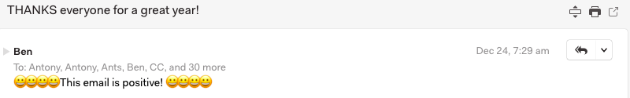

## N1 Email Sentiment Plugin

An N1 plugin to let you know the sentiment information of your email.

Current sentiment values
* Positive
* Neutral
* Negitive

### Install

The plugin currently uses [Azure Cognitive Services](https://www.microsoft.com/cognitive-services/en-us/text-analytics-api) for the sentiment API (because I have a lot of free credit)

* `git clone https://github.com/NotThatSmith/N1EmailSentiment.git`
* Update `"Ocp-Apim-Subscription-Key": 'XXXXX Subscription key goes here XXXXX'` with your api key
* In N1 `Developer > Install a Plugin` and choose this directory
